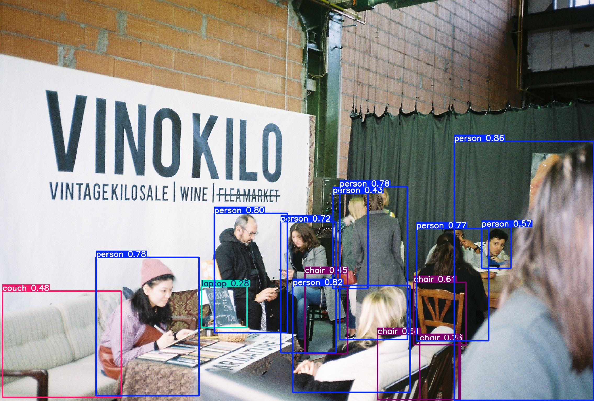

# YOLOv5-detection
YOLOv5 Object Detection Experiments and Results

# YOLOv5 Object Detection on Film Photos
This project uses **YOLOv5** to perform object detection on both public datasets and personal analog film image.

## Overview
- Model: **YOLOv5s** (pretrained)
- Platform: **Google Colab**
- Dataset: **COCO val2017** + **personal image**
- Evaluation: **mAP@0.5: 56.6%, Precision: 67.1%, Recall: 51.9%**

##** Detection Result Example 

{Photo was taken while studying in Germany..)

## Code Notebook
[here](./YOLO_model.ipynb)

## 🎯 Parameters for Detection
```bash
python detect.py --weights yolov5s.pt --img 640 --conf 0.25 --source R1-04665-0007.JPG

**Confidence threshold: 0.25
Image size: 640x640
Inference speed: ~29ms per image (on Tesla T4)**

## What I Learned
- Applied YOLOv5 to a non-standard image type (analog film)
- Learned how to set up detection pipeline with Google Colab
- Understood basic metrics (Precision, Recall, mAP) for evaluating models
